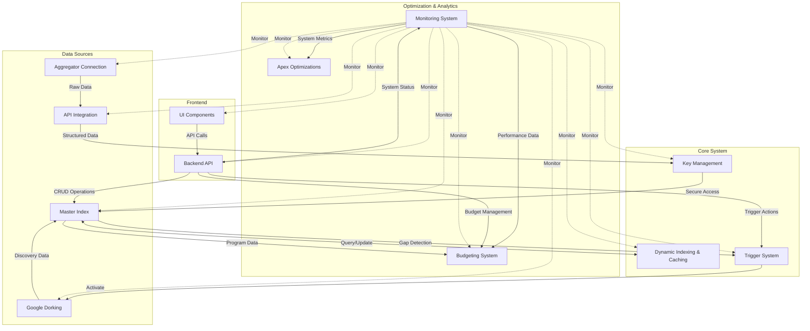
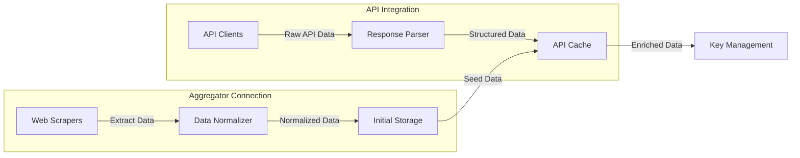
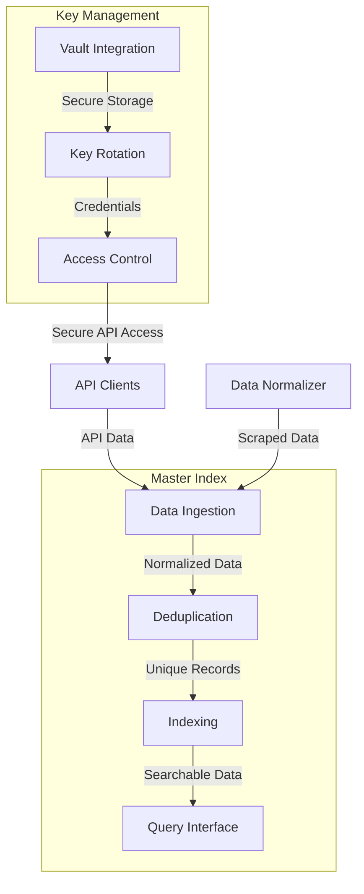
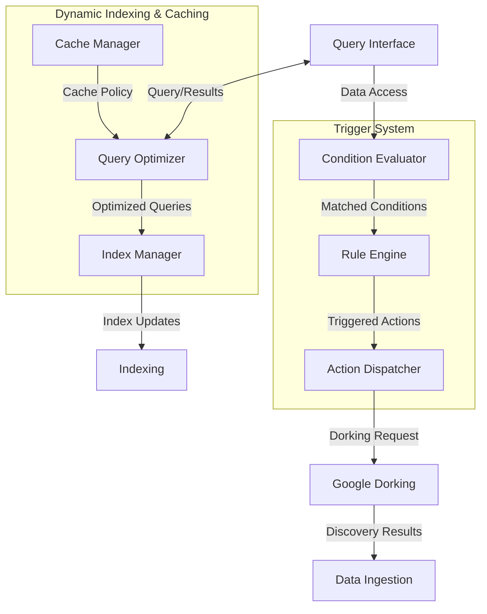
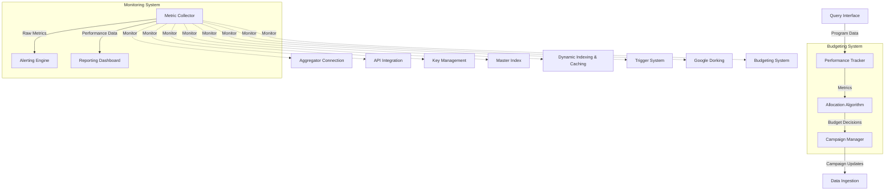
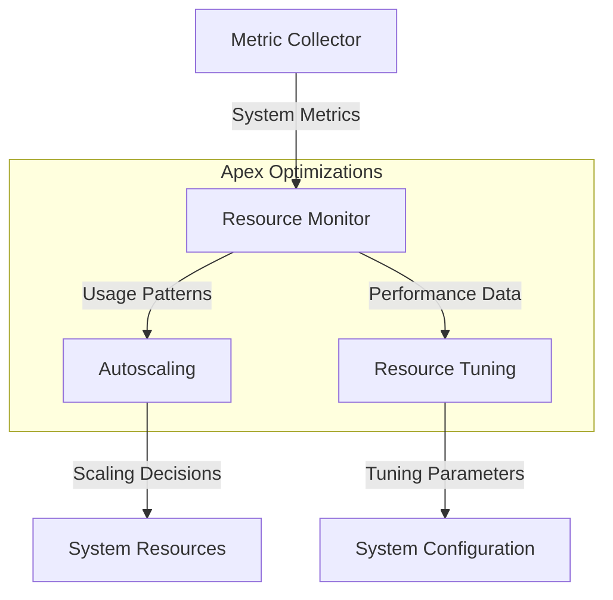
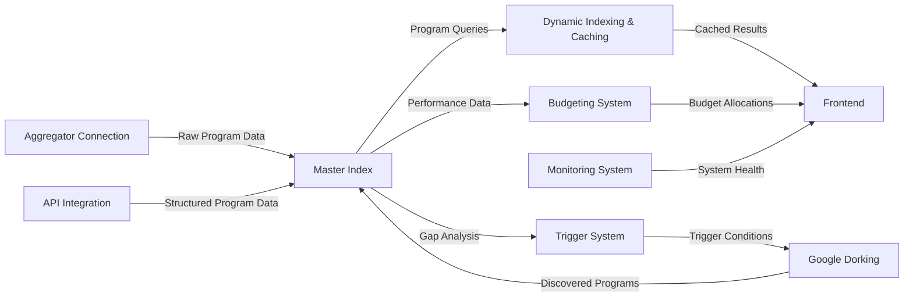

# Integration Blueprint for Affiliate Matrix

This document provides a comprehensive overview of how the various components of the Affiliate Matrix system integrate with each other, with special focus on the remaining implementation tasks.

## System Architecture Overview

The Affiliate Matrix system follows a modular architecture with clear separation of concerns. The diagram below illustrates the high-level architecture and how components interact:

## Component Integration Details

### 1. Aggregator Connection & API Integration (Steps 1-2)

The Aggregator Connection and API Integration components form the data acquisition layer of the system:

**Integration Points:**
- The Aggregator Connection provides initial seed data for the system
- The API Integration layer builds on this by adding structured, reliable data access
- Both components feed data into the Master Index through a standardized data format
- The Key Management system secures access to the API Integration layer

**Implementation Considerations:**
- Implement a common data model that both components can produce
- Create a unified interface for data retrieval regardless of source
- Ensure proper error handling and retry logic for both web scraping and API calls
- Implement rate limiting to avoid overloading data sources

### 2. Key Management & Master Index (Steps 3-4)

The Key Management and Master Index components form the core data management layer:

**Integration Points:**
- Key Management secures access to external APIs
- The Master Index receives data from both Aggregator Connection and API Integration
- The Master Index provides a unified query interface for all other components
- Dynamic Indexing & Caching optimizes access to the Master Index

**Implementation Considerations:**
- Implement a secure credential storage system using HashiCorp Vault or similar
- Create a robust data model for affiliate programs with proper validation
- Design efficient indexing strategies for common query patterns
- Implement data quality checks and enrichment processes

### 3. Dynamic Indexing & Caching and Trigger System (Steps 5 & 7)

These components optimize performance and automate operations:

**Integration Points:**
- Dynamic Indexing & Caching sits between clients and the Master Index
- The Trigger System monitors the Master Index for gaps and trends
- Triggers activate Google Dorking for opportunistic discovery
- Google Dorking results feed back into the Master Index

**Implementation Considerations:**
- Implement efficient caching strategies with proper invalidation
- Design a flexible rule engine for defining trigger conditions
- Create a robust action dispatcher that can handle various triggered actions
- Ensure proper error handling and retry logic for triggered actions

### 4. Budgeting System & Monitoring (Steps 8 & 10)

These components handle optimization and system health:

**Integration Points:**
- The Budgeting System uses data from the Master Index to make allocation decisions
- The Monitoring System collects metrics from all components
- Monitoring data feeds into the Budgeting System for performance-based allocations
- Monitoring alerts can trigger system optimizations

**Implementation Considerations:**
- Implement comprehensive metrics collection throughout the system
- Design flexible allocation algorithms that can adapt to different strategies
- Create intuitive dashboards for monitoring system health
- Implement alerting with appropriate severity levels and notification channels

### 5. Apex Optimizations (Step 9)

The Apex Optimizations component focuses on system efficiency:

**Integration Points:**
- Apex Optimizations use data from the Monitoring System
- Optimizations affect all components through resource allocation and configuration
- The system should be designed to scale based on demand

**Implementation Considerations:**
- Implement resource usage monitoring and analysis
- Design autoscaling policies for different components
- Create configuration management for system tuning
- Ensure all components can scale horizontally when needed

## Data Flow

The following diagram illustrates the primary data flows through the system:

## Integration Challenges and Solutions

### Challenge 1: Data Consistency

**Challenge**: Ensuring consistent data format and quality from multiple sources.

**Solution**: 
- Implement a standardized data model with validation
- Create data normalization pipelines for each source
- Implement data quality checks and enrichment processes
- Use the Master Index as the single source of truth

### Challenge 2: Secure API Access

**Challenge**: Managing and securing access to multiple external APIs.

**Solution**:
- Implement a centralized key management system
- Use secure credential storage (Vault)
- Implement key rotation and monitoring
- Create fallback mechanisms for API failures

### Challenge 3: Performance at Scale

**Challenge**: Maintaining performance as the data volume grows.

**Solution**:
- Implement efficient indexing strategies
- Use caching with appropriate invalidation
- Design for horizontal scalability
- Implement query optimization

### Challenge 4: Resource Efficiency

**Challenge**: Optimizing resource usage for cost-effectiveness.

**Solution**:
- Implement trigger-based processing for resource-intensive tasks
- Use caching to reduce redundant operations
- Implement autoscaling based on demand
- Monitor and tune resource usage

## Testing Integration Points

When implementing and testing the integration between components, focus on these key areas:

1. **Data Transformation**: Ensure data maintains integrity as it flows between components
2. **Error Handling**: Verify that errors in one component don't cascade to others
3. **Performance**: Test the system under various load conditions
4. **Security**: Ensure secure communication between components
5. **Scalability**: Verify that components can scale independently

## Conclusion

This integration blueprint provides a comprehensive guide to how the components of the Affiliate Matrix system work together. By following this blueprint, developers can ensure that new implementations integrate seamlessly with existing components and maintain the overall system architecture.

The modular design allows for incremental implementation, with each component building on the foundation provided by previous steps. This approach enables the system to deliver value at each stage of development while working toward the complete vision of an automated affiliate marketing system.
